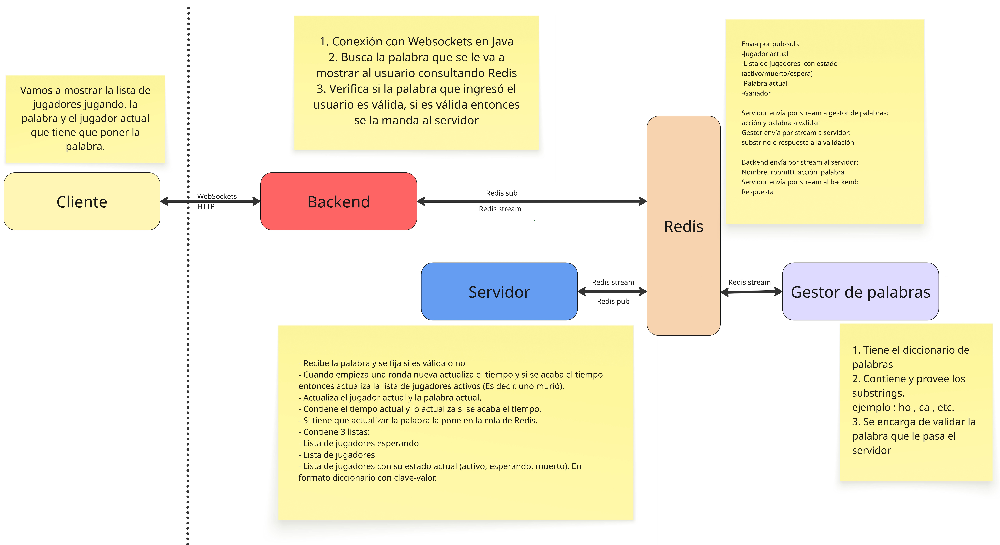
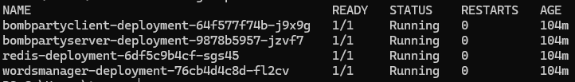
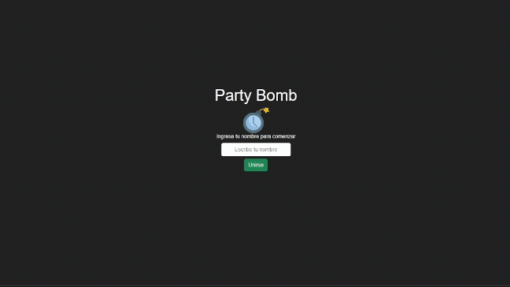
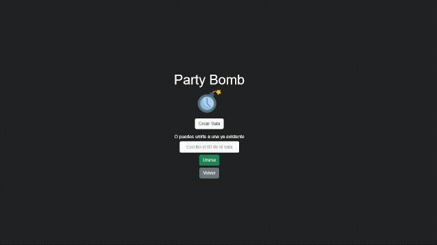

# BombParty
Proyecto para la materia "Sistemas Distribuidos" del año 2025

## Integrantes
- Ramirez Victor
- Rando Tomás
- Ruiz Joaquin

## Descripción
El proyecto se basa en una simplificación del juego Bomb Party. En este, se contará con un grupo de jugadores, los cuales deberán escribir una palabra que contenga el fragmento que aparece en pantalla. La palabra en cuestión debe ser existente.

La partida del juego se dividirá en rondas, donde en cada ronda se elimina a un jugador hasta que solo quede uno, que resultará ganador. Cada ronda tiene una duración aleatoria de tiempo, y durante estas, cada jugador debe escribir la palabra que le aparece en pantalla lo más rápido posible en su respectivo turno, cuando el temporizador llega a 0 (los jugadores no verán el temporizador), el jugador al que le tocaba escribir, pierde. 

## Diseño
Para la implementación del proyecto contaremos con cuatro componentes principales, cada uno cumpliendo su función específica. Estos son:
- UI - Cliente: Es el componente visual del proyecto. Se comunica con el backend utilizando HTTP y websockets. Es implementado mediante un conjunto de archivos javascript, html y css, los cuales son provistos por el backend Spring.
- Backend - Cliente: Es el componente web encargado de leer las palabras y los datos desde Redis. Además, se encarga de enviar los datos del jugador al servidor. En el caso de los datos de las partidas, se implementa mediante un modelo pub-sub, en cambio, para enviar datos al servidor se utilizan streams. Es implementado en Java utilizando Spring.
- Servidor: El servidor se encargará de gestionar la partida, junto a sus jugadores. Se encargará, entre otras cosas, de proveer palabras a los clientes mediante Redis, gestionar el tiempo de cada ronda, validar las respuestas de los jugadores y mantener la lista de usuarios. Se comunica con el gestor de palabras mediante streams en Redis y con el backend del cliente mediante streams y pub-sub, también en Redis. Fue implementado en Python.
- Redis: Es el medio de comunicación entre todos los componentes. Posee información vital para cada ronda. Por ejemplo, el jugador actual, la lista de jugadores con su respectivo estado, la palabra actual y el ganador de la partida. Además, por este medio se envían las solicitudes al gestor de palabras y al servidor.
- Gestor de palabras: Es el componente que brinda palabras al servidor y valida las que este le envía. Fue también implementado en Python.
  

### Uso
La aplicación está actualmente desplegada con un load balancer en el cluster de la Facultad de Ingeniería de la Uncuyo. Por ello, si se cuenta con acceso a la red de la Facultad, se puede ingresar directamente utilizando el enlace [http://10.66.100.151](http://10.66.100.151).

### Despliegue
Para poder desplegar el proyecto se deberá ejecutar el siguiente comando: **kubectl apply -f bombparty-deployment.yaml**, que levantará los pods de los componentes servidor, backend, redis y proveedor de palabras.

Una vez levantados los pods, existen dos opciones para ingresar a la aplicación:
- Utilizar port-forward: Primero, debemos colocar el comando **kubectl get pods** para obtener el nombre exacto del pod del cliente. Podremos diferenciarlo ya que su nombre comienza con "bombpartyclient-deployment". Luego, debemos usar el comando **kubectl port-forward {nombre del pod} 80:8080**. Llegados a este punto, ya podremos ingresar a la aplicación ingresando en el navegador la url **localhost:80**.
- Utilizando un load balancer: Si se tiene la posibilidad, se puede solicitar un load balancer que exponga el puerto 80 y redirija el tráfico al servicio con selector **app: bombpartyclient-app**, con puerto destino 8080. Para esto, se cuenta con el .yaml con el nombre de **lb.yaml**. Al quedar este paso listo, se puede acceder a la aplicación colocando en el navegador la ip asignada al load balancer.

### Dentro del juego
Al ingresar, debemos escribir nuestro nombre en el campo de texto y apretar el botón "Unirse".

  

Luego, si no existe una partida creada, podremos crear nuestra partida haciendo click en el botón "Crear Sala". Esto nos llevará a una nueva vista, donde nos interesará el texto "ID de la sala:". Este id es el que será utilizado por otros para ingresar a la partida.

  

En el caso de que la sala ya se encuentre creada, tenemos la opción de ingresar a ella. Para eso, necesitaremos el id de la sala. En la pantalla donde se encontraba la opción "Crear sala" debemos ingresar el id en el campo de texto y a continuación seleccionar la opción "Unirse".

  

Cuando dos personas hayan ingresado a la sala, la partida comenzará automáticamente luego de 20 segundos. Será el turno de alguna persona, la cual estará resaltada en la lista de participantes. Dicho participante deberá escribir una palabra existente que contenga la palabra que aparece en pantalla. Si la palabra es correcta, será el turno del otro jugador y este deberá hacer lo mismo. En el caso de que la respuesta sea incorrecta, esto se indicará en pantalla y se debe intentar nuevamente. Pasada una cantidad de segundos aleatoria, la bomba explotará y el jugador que no alcanzó a escribir la palabra morirá. El juego continúa de esta manera hasta que quede 1 jugador, quien resultará ganador. Luego de finalizar la partida, la misma vuelve a comenzar pasados 20 segundos si hay suficientes jugadores (más de 1) conectados.

  

